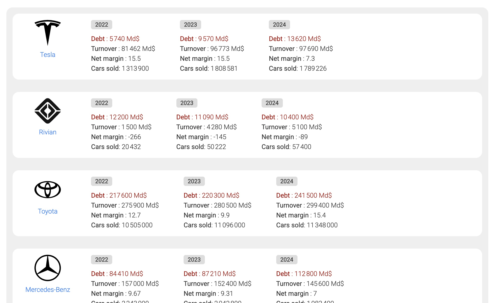

# automotive
Automotive figures and debt

See the figures for the largest car manufacturers.
- Financial debt
- Number of cars sold
- Net margin
- Turnover


# 🚗 AutoStats JS

Un projet JavaScript natif permettant d’afficher dynamiquement des statistiques de marques automobiles (ventes, chiffre d’affaires, marges, dettes, etc.) dans une interface web responsive, sans framework externe.

## 🛠 Technologies utilisées

- **JavaScript** (ES6+)
- **HTML5**
- **CSS3**
- Aucun framework — Code 100% natif

## 📸 Aperçu



## ✨ Fonctionnalités

- Visualisation des données financières par constructeur automobile
- Design responsive compatible mobile, tablette et desktop
- Composants réutilisables en JavaScript pur
- Chargement dynamique des données (JSON)
- Interface utilisateur propre et épurée

## 📁 Structure du projet

```text
├── index.html
├── css/
│   └── styles.css
├── js/
│   └── main.js
├── data/
│   └── data.json
├── assets/
│   └── logos/
│       └── [marques].svg
├── README.md

## Remove file .DS_Store

https://gist.github.com/lohenyumnam/2b127b9c3d1435dc12a33613c44e6308
